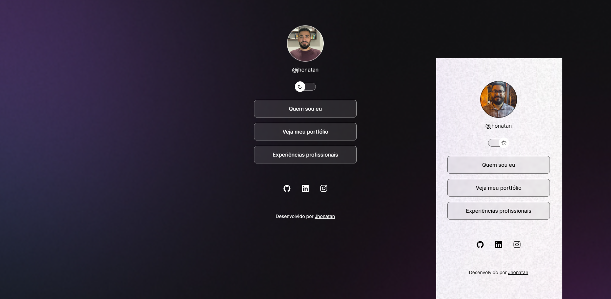

<h1 align="center"> Página Jhonatan </h1>

Projeto desenvolvido com os conceitos aprendidos no programa Discover da Rocketseat.  

 

  

## 🚀 Tecnologias

Esse projeto foi desenvolvido com as seguintes tecnologias:

- HTML e CSS
- JavaScript
- Git e Github
- Figma

## 💻 Projeto

O DevLinks é um agregador de links para usar como cartão de visitas online.

- [Acesse o projeto finalizado, online](https://github.com/JhonatanSilva90/Projeto-Pagina-Pessoal.git)